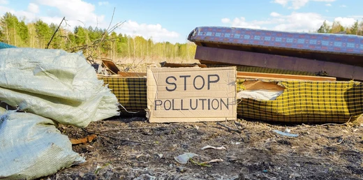

# Illegal Dumping Site Detector

### Using Deep Learning, satellite imagery, and spatial intelligence to identify illegal dumping sites

_A smart location intelligence tool combining satellite imagery, OpenStreetMap data, and AI models. By Shivam_

**Illegal dumping** is a persistent environmental and public health challenge in cities and rural areas alike. Sites used for unauthorized waste disposal often go undetected for long periods — causing soil contamination, water pollution, and health hazards for nearby communities.

Traditional inspection-based monitoring is **slow, resource-intensive**, and reactive. By combining **satellite imagery**, **spatial data from OpenStreetMap**, and **deep learning-based object detection**, this tool offers a faster, scalable approach to flagging suspicious locations automatically.

### Goal of the Project

The goal was to build an interactive tool that, given a GPS coordinate, can **predict whether a location is being used as an illegal dumping site**.

The system combines:
- **Visual signals** from satellite imagery (detected garbage, building density)
- **Spatial signals** from OpenStreetMap (proximity to roads, buildings, police stations)
- A trained **classification model** that fuses both feature sets into a final legality prediction

### What I Did

- I used **YOLOv7** for object detection on satellite tiles:
  - A **garbage detection model** (`garbage.pt`) trained to spot waste accumulation in satellite imagery
  - A **building detection model** (`building.pt`) to assess the built environment around the site
  - Both models output **bounding boxes** overlaid directly on the satellite tile in the app
- For **spatial feature extraction**, I queried **OpenStreetMap via OSMnx**:
  - Nearby **road networks** (type and density)
  - Proximity to **police stations** and other points of interest
  - Surrounding **building footprints** and land use
- A **classification model** (`classModel.h5`) trained on a combination of spatial and visual features produces the final **legality prediction with a confidence score**
- Everything is wrapped in a **Streamlit web app** that allows users to:
  - Enter GPS coordinates or **pin a location on an interactive map**
  - Automatically **fetch the corresponding satellite tile**
  - Run detection and classification with a single click
  - View results including **detected objects and prediction scores** in-browser

### Use

You can explore the tool by running the **Streamlit app** locally. Below is a short walkthrough of what to expect: entering a coordinate, fetching the tile, and seeing object detections alongside the legality verdict.

To **run the Streamlit App**, clone the repository, install dependencies, and place your model weights in the correct directory:

```bash
git clone https://github.com/your-username/illegal-site-detector.git
cd illegal-site-detector/
pip install -r requirements.txt
```

**Important:** Before running, make sure your trained model files are placed in the `model_wts/` directory:

```
model_wts/
├── garbage.pt
├── building.pt
└── classModel.h5
```

Then launch the app:

```bash
streamlit run app.py
```

> **Note:** The app fetches satellite tiles from public map tile servers and queries OpenStreetMap for spatial features. An **internet connection is required** for full functionality.

### Examples

Here is an example of the app detecting garbage and buildings on a satellite tile, alongside the classification output:

_[Add screenshot or screen recording here]_

Some **output examples** from the tool:

#### Satellite Tile with Object Detection

_[Add example image: satellite tile with YOLO bounding boxes]_

#### Classification Output

_[Add example showing prediction score and legality verdict]_

### Requirements

See `requirements.txt` for the full dependency list. Key packages include:

| Package | Purpose |
|---|---|
| `streamlit` | Web app interface |
| `torch` | YOLOv7 inference |
| `tensorflow` | Classification model |
| `opencv-python` | Image processing |
| `osmnx` | OpenStreetMap spatial queries |
| `shapely` | Geometric operations |
| `folium` | Interactive map |
| `geopy` | Coordinate utilities |

### Thanks

- ... to the **YOLOv7 team** for their open-source object detection framework.
- ... to the contributors of **OSMnx** for making spatial queries from OpenStreetMap accessible.
- ... to the open-source community for satellite tile APIs and geospatial tooling that made this project possible.

---

_Created as a proof-of-concept for AI-assisted environmental monitoring using publicly available satellite and spatial data._
